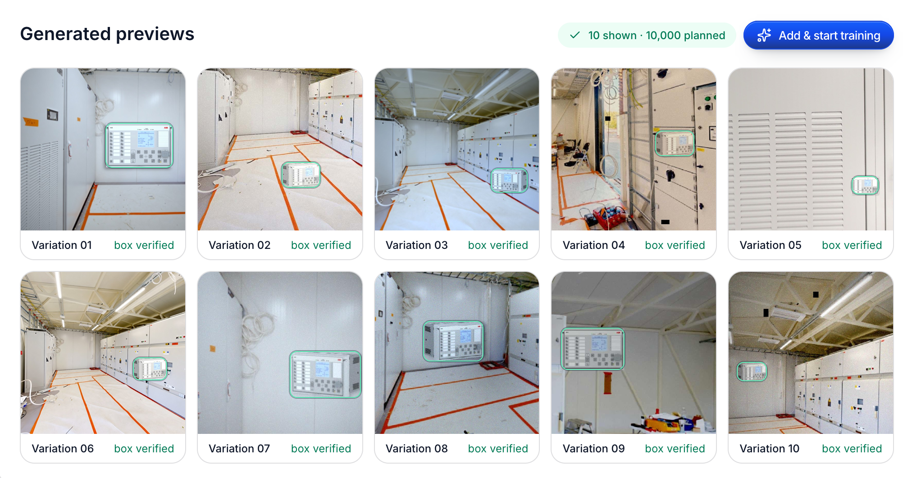

# TwinTag Frontend

Web interface for exploring industrial digital twins and reviewing detected assets, built for the VEO360 challenge at JunctionX Vaasa.




## What it does

- Explore the site's point cloud and registered scan imagery.
- Review detected ABB REX615 relays, their 3D positions, and supporting observations.
- Read extracted labels and inspection context, and open linked equipment manuals.
- Prepare and export Matterport-compatible tag requests.

The recorded demo uses precomputed backend results. Detection uses YOLO11m; context extraction uses pretrained Qwen3-VL-8B-Instruct. See the [backend model results](https://github.com/itsdaxen/twintag-backend/blob/main/MODEL_PERFORMANCE.md).

## Training performance

YOLO11m was trained on a **RunPod NVIDIA RTX 4090**, using **8,000 training images and 2,000 synthetic validation images**. The saved checkpoint from epoch 8 achieved:

| Metric | Result |
| --- | --- |
| mAP@50 | 99.5% |
| mAP@50–95 | 99.49% |
| Precision | 100% |
| Recall | 99.995% |

The [training log](https://github.com/itsdaxen/twintag-backend/blob/main/docs/model/rex615-training-results.csv) contains 10 epochs. On the real scan, 108 images produced 38 observations and 7 fused asset tags at an 85% confidence cutoff.

The demo reads saved Qwen3-VL context extraction results. Training hardware and dataset details are corroborated by the original hackathon session's execution outputs; see [run provenance](https://github.com/itsdaxen/twintag-backend/blob/main/docs/model/training-provenance.json).

## Run locally

```bash
pnpm install
pnpm dev
```

Start the [backend](https://github.com/itsdaxen/twintag-backend) on `http://localhost:8000`; the frontend runs on `http://localhost:3000`. For another backend address, set `NEXT_PUBLIC_API_URL` and `TWINTAG_API_URL` before starting the frontend.
